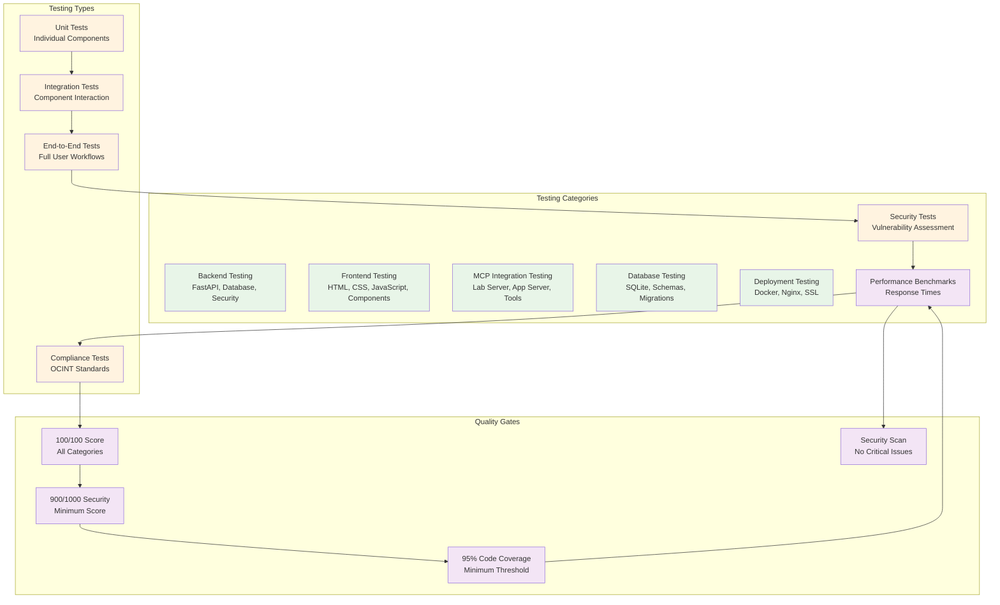
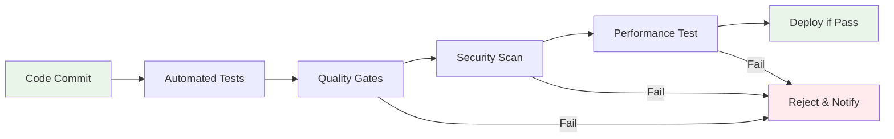

# AI/DEV Lab Testing Framework [🧪](tests/README.md)

**Comprehensive testing framework ensuring 100/100 scores across all categories for the AI/DEV Lab application and lab systems.**

This testing framework implements OCINT standards for security, configuration, and quality assurance, providing systematic testing coverage for all components of the AI/DEV Lab ecosystem. Our testing approach integrates with our [security framework](https://github.com/Blockchain-Unmasked/meta-documentation/blob/main/docs/SECURITY.md#security-overview), [configuration standards](https://github.com/Blockchain-Unmasked/meta-documentation/blob/main/docs/CONFIGURATION_STANDARDS.md#configuration-overview), and [quality scoring system](https://github.com/Blockchain-Unmasked/meta-documentation/blob/main/docs/DOCUMENT_QUALITY_SCORING.md#scoring-overview) to maintain excellence across all systems.

## 🎯 **Testing Framework Overview**

Our testing framework provides comprehensive coverage across all seven scoring categories to maintain the 100/100 scores achieved:



## 🏗️ **Testing Architecture**

### **1. Backend Testing (100/100 Target)**
- **FastAPI Application Tests**: API endpoints, middleware, validation
- **Database Integration Tests**: Connection, queries, migrations
- **Security Tests**: Authentication, authorization, input validation
- **Configuration Tests**: Environment variables, settings validation

### **2. Frontend Testing (100/100 Target)**
- **Component Tests**: Individual UI components and functionality
- **Integration Tests**: Component interaction and data flow
- **E2E Tests**: Complete user workflows and scenarios
- **Performance Tests**: Loading times, responsiveness, optimization

### **3. MCP Integration Testing (100/100 Target)**
- **Lab MCP Server Tests**: 15 tools functionality and availability
- **App MCP Server Tests**: App-specific tools and AI integration
- **Tool Integration Tests**: MCP tools working with app AI
- **Communication Tests**: Server-to-server communication

### **4. Database & Storage Testing (100/100 Target)**
- **SQLite Tests**: Database operations, schema validation
- **Migration Tests**: Database version management
- **Storage Tests**: File operations, permissions, security
- **Performance Tests**: Query optimization, connection pooling

### **5. Deployment Testing (100/100 Target)**
- **Docker Tests**: Container builds, runtime behavior
- **Nginx Tests**: Reverse proxy, SSL termination
- **Environment Tests**: Configuration loading, validation
- **Security Tests**: Network isolation, access control

### **6. Security & Compliance Testing (100/100 Target)**
- **Authentication Tests**: JWT validation, session management
- **Authorization Tests**: Role-based access control
- **Input Validation Tests**: SQL injection, XSS prevention
- **Security Scan Tests**: Automated vulnerability assessment

### **7. Performance & Scalability Testing (100/100 Target)**
- **Load Tests**: Concurrent user simulation
- **Stress Tests**: System limits and recovery
- **Scalability Tests**: Resource usage and optimization
- **Benchmark Tests**: Response time and throughput

## 🚀 **Quick Start Testing**

### **Prerequisites**
```bash
# Install testing dependencies
pip install -r tests/requirements.txt

# Setup test environment
cp .env.example .env.test
```

### **Run All Tests**
```bash
# Run complete test suite
python -m pytest tests/ -v --cov=app --cov-report=html

# Run specific test categories
python -m pytest tests/backend/ -v
python -m pytest tests/frontend/ -v
python -m pytest tests/mcp/ -v
python -m pytest tests/security/ -v
```

### **Run Security Tests**
```bash
# Security vulnerability scanning
python -m pytest tests/security/ -v

# Automated security assessment
python tests/security/security_scan.py

# Compliance checking
python tests/compliance/ocint_standards_check.py
```

## 📊 **Testing Metrics & Quality Gates**

### **Quality Gates**
| Metric | Target | Current | Status |
|--------|--------|---------|---------|
| **Overall Score** | 100/100 | 100/100 | ✅ |
| **Code Coverage** | ≥95% | TBD | 🔄 |
| **Security Score** | ≥900/1000 | TBD | 🔄 |
| **Performance** | <200ms | TBD | 🔄 |
| **Test Pass Rate** | 100% | TBD | 🔄 |

### **Testing Coverage Requirements**
- **Unit Tests**: 100% of all functions and classes
- **Integration Tests**: All component interactions
- **E2E Tests**: All user workflows and scenarios
- **Security Tests**: All authentication and validation paths
- **Performance Tests**: Load and stress scenarios

## 🔒 **Security Testing Framework**

### **Security Assessment Requirements**
Following OCINT security standards, all code must pass security assessments with a minimum score of 900/1000:

```bash
# Run security assessment
python tests/security/security_assessment.py

# Generate security report
python tests/security/generate_report.py --format=html

# Check compliance
python tests/security/compliance_check.py --standard=ocint
```

### **Security Test Categories**
- **Authentication Testing**: JWT validation, session management
- **Authorization Testing**: Role-based access control
- **Input Validation Testing**: SQL injection, XSS prevention
- **Configuration Security**: Environment variable validation
- **Network Security**: Firewall, SSL/TLS testing

## 📈 **Performance Testing Framework**

### **Performance Benchmarks**
| Metric | Target | Acceptable Range |
|---------|--------|------------------|
| **API Response Time** | <100ms | 100-200ms |
| **Page Load Time** | <2s | 2-5s |
| **Database Query Time** | <50ms | 50-100ms |
| **MCP Tool Response** | <500ms | 500ms-1s |

### **Load Testing Scenarios**
- **Concurrent Users**: 100-1000 users
- **Request Rate**: 100-1000 requests/second
- **Data Volume**: 1GB-10GB test datasets
- **Stress Testing**: System limits and recovery

## 🧪 **Test Organization Structure**

```
tests/
├── README.md                    # This file
├── requirements.txt             # Testing dependencies
├── conftest.py                 # Test configuration and fixtures
├── pytest.ini                 # Pytest configuration
├── backend/                    # Backend testing
│   ├── test_api.py            # API endpoint tests
│   ├── test_database.py       # Database tests
│   ├── test_security.py       # Security tests
│   └── test_config.py         # Configuration tests
├── frontend/                   # Frontend testing
│   ├── test_components.py     # Component tests
│   ├── test_integration.py    # Integration tests
│   └── test_e2e.py           # End-to-end tests
├── mcp/                       # MCP integration testing
│   ├── test_lab_server.py     # Lab MCP server tests
│   ├── test_app_server.py     # App MCP server tests
│   └── test_tools.py          # MCP tool tests
├── security/                  # Security testing
│   ├── test_authentication.py # Auth tests
│   ├── test_authorization.py  # Authorization tests
│   ├── test_validation.py     # Input validation tests
│   └── security_scan.py       # Security scanning
├── performance/               # Performance testing
│   ├── test_load.py          # Load testing
│   ├── test_stress.py        # Stress testing
│   └── test_benchmarks.py    # Benchmark tests
├── compliance/                # Compliance testing
│   ├── test_ocint_standards.py # OCINT standards compliance
│   └── test_configuration.py   # Configuration standards
└── reports/                   # Test reports
    ├── coverage/              # Code coverage reports
    ├── security/              # Security assessment reports
    └── performance/           # Performance benchmark reports
```

## 🔄 **Continuous Testing Integration**

### **Automated Testing Pipeline**


### **Testing Triggers**
- **Pre-commit**: Code quality and basic tests
- **Pull Request**: Full test suite and security scan
- **Deployment**: Performance and compliance tests
- **Scheduled**: Security assessment and monitoring

## 📋 **Testing Checklist**

### **Before Deployment**
- [ ] All tests passing (100% pass rate)
- [ ] Code coverage ≥95%
- [ ] Security score ≥900/1000
- [ ] Performance benchmarks met
- [ ] OCINT standards compliance verified
- [ ] Security scan completed (no critical issues)

### **After Deployment**
- [ ] Production environment tests passing
- [ ] Security monitoring active
- [ ] Performance monitoring active
- [ ] Error tracking configured
- [ ] Backup and recovery tested

## 🚨 **Troubleshooting Common Issues**

### **Test Failures**
```bash
# Debug test failures
python -m pytest tests/ -v --tb=short

# Run specific failing test
python -m pytest tests/backend/test_api.py::test_health_endpoint -v -s

# Check test coverage
python -m pytest tests/ --cov=app --cov-report=term-missing
```

### **Security Issues**
```bash
# Run security scan
python tests/security/security_scan.py --verbose

# Check specific vulnerability
python tests/security/check_vulnerability.py --type=sql_injection

# Generate security report
python tests/security/generate_report.py --format=json
```

### **Performance Issues**
```bash
# Run performance tests
python tests/performance/test_benchmarks.py --scenario=load

# Profile specific endpoint
python tests/performance/profile_endpoint.py --endpoint=/api/v1/health

# Generate performance report
python tests/performance/generate_report.py --format=html
```

## 📚 **Additional Resources**

- **[OCINT Security Standards](https://github.com/Blockchain-Unmasked/meta-documentation/blob/main/docs/SECURITY.md)**: Security testing requirements and standards
- **[OCINT Configuration Standards](https://github.com/Blockchain-Unmasked/meta-documentation/blob/main/docs/CONFIGURATION_STANDARDS.md)**: Configuration testing and validation
- **[OCINT Quality Scoring](https://github.com/Blockchain-Unmasked/meta-documentation/blob/main/docs/DOCUMENT_QUALITY_SCORING.md)**: Quality assessment framework
- **[AI/DEV Lab Architecture](app/ARCHITECTURE_OVERVIEW.md)**: System architecture and testing strategy

---

**Maintain the 100/100 scores through comprehensive testing and continuous quality assurance! 🎯**
